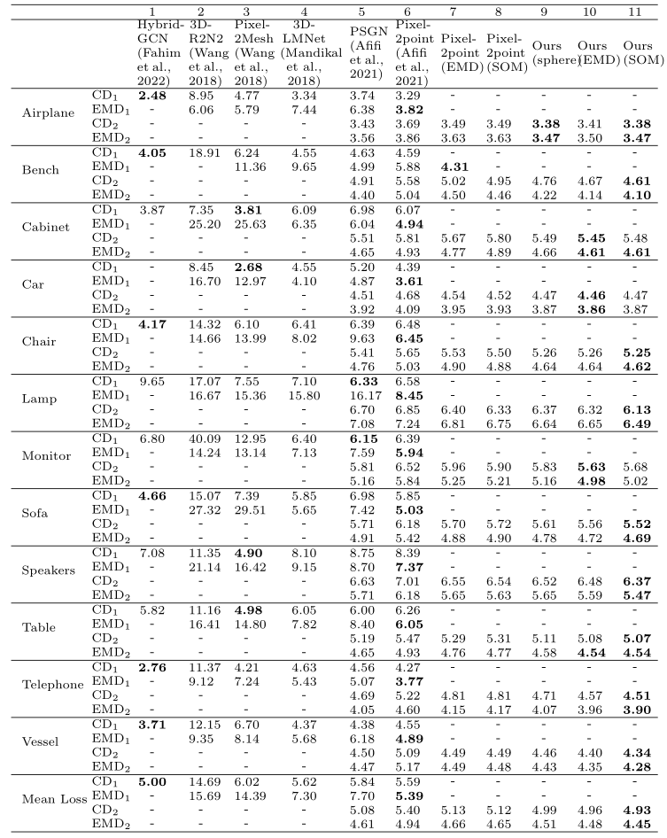

**Pytorch implementation of 3D SOC-Net: Deep 3D Reconstruction Network based on Self-Organizing Clustering Mapping.**

## Datasets
We use the ShapeNetCoreV1 dataset(https://www.shapenet.org/) in our experiments, the ShapeNet rendering images are from http://cvgl.stanford.edu/data2/ShapeNetRendering.tgz

Our prepared dataset is available in the following link:
https://xmueducn-my.sharepoint.com/:f:/g/personal/dmt1809254_xmu_edu_my/Er7mpTrlB8xBjyKqtbtHQ9sBh_tkgv8ZYo6ayvdZJAQLbQ?e=RVaDQZ

The dataset files should be put inside dataset_split folder

## Pretrained Models

The pretrained models on ShapeNet are available in the following link: https://xmueducn-my.sharepoint.com/:f:/g/personal/dmt1809254_xmu_edu_my/EgBCkDNkVhlMtJqZ_DvExW8Bu9DTOJ8ZzYTVi9avn-mV9g?e=7uJO6h

## Executing Environment
The code has been tested on Windows 10, Python 3.7.9, PyTorch 1.8.0, CUDA 10.2

## Get Started
To train all the models, you can simply execute main.py in execute folders.
To train a specific model, you can execute main.py in corresponding folders.

## Testing Results
The table below shows the quantitatlive testing results. Note that the CD1 and EMD1 refer to results obtained from the original works, whereas CD2 and EMD2 denote the replicated results.

The table below shows the visualization of testing results.

